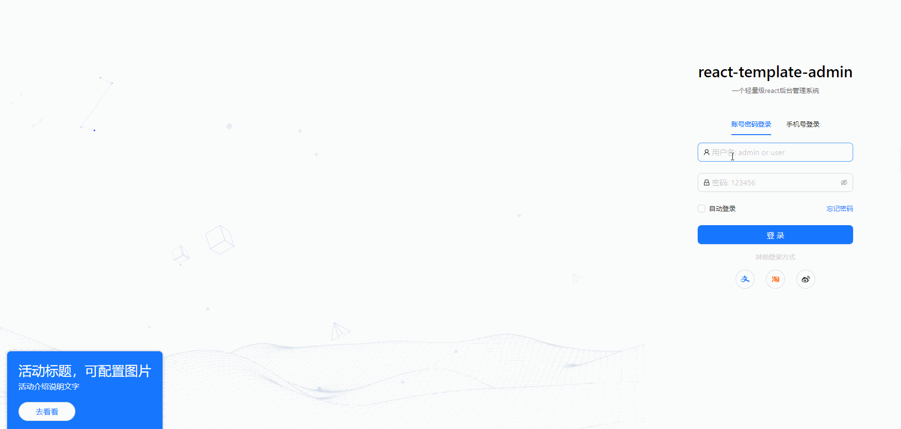

<p align="center">
   <a>
      
   </a>
</p>
<!-- href="https://nlrx-wjc.github.io/react-antd-admin-template/" target="_blank" -->

һ�������� React18 ��˹���ģ� 壬 ּ�ڿ��ٴ��˹���ϵͳ�����������ܲ������ɷ�װ��������չ

����ջ��

- react18
- react-router6
- zustand4
- vite4
- axios
- fakerjs��
- dayjs
  ......

֧�ֵĹ��ܣ�

- [x] ��¼/�˳���¼
- [x] ���ݳ־û�� 洢
- [x] ·�ɼ�Ȩ
- [x] ��̬����
- [x] ������
- [x] axios ��װ

# Ŀ¼�ṹ

```bash
���� public                     # ��̬��Դ
��   ���� favicon.ico            # faviconͼ��
���� src                        # ��ĿԴ����
��   ���� components             # ȫ�ֹ������
��   ���� layout                 # �������
��   ���� config                 # ȫ������
��   ��   ���� router.tsx         # ·������
��   ���� services               # api�ӿ�
��   ���� stores                 # ȫ�� store����
��   ���� utils                  # ȫ�ֹ��÷���
��   ���� pages                  # pages ����ҳ��
��   ���� App.tsx                # ���ҳ��
��   ���� global.d.ts            # ȫ�������ļ�
��   ���� index.css              # ȫ����ʽ�ļ�
��   ����index.tsx               # Դ�����
������ .commitlintrc.js          # �Զ���commitlint
������ .cz-config.js             # �Զ���commitlint
������ .eslintignore             # eslint�����ļ�
������ .eslintrc.js              # eslint����
������ .prettierrc.js            # prettier����
������ vite.config.js            # vite�������
������ index.html                # htmlģ��
������ package.json              # package.json
```

# ��װ��ʹ��

```shell
# ��¡��Ŀ
git clone https://github.com/panyushan-jade/react-template-admin.git

# ������ĿĿ¼
cd react-template-admin

# ��װ����
pnpm install(�Ƽ�ʹ��pnpm)

# ����
pnpm start

# ����
pnpm build

# Ԥ��
pnpm preview

```

# ����Ч��(�˺����������)

<p align="center">
   
</p>

# git �ύ

```shell
# ���ӵ��ݴ���
git add -A

# �ύ����
pnpm cz
������ʾ��һ�����У�.cz-config.js�����޸���ʾ�������

```

## ���

Ŀǰ���кܶ಻��ĵط������������в������뷨�����õ�ʵ�ֿ����� pr�����һ��ѧϰ����~</br>
�������������Ŀ����������� star ?? ֧��һ�� thanks~

# react-admin
